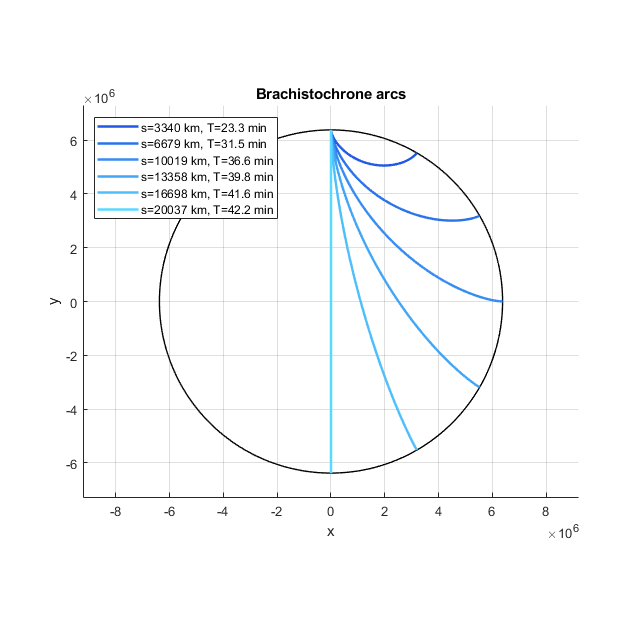

# Brachistochrone in a Uniform-Density Planet
Terrestrial brachistochrone paths + analytical calculations

Visualizes the brachistochrone tunnels inside a uniform-density planet by plotting the optimal (minimum-time) hypocycloid paths in a 2D disk.

Example with Earth parameters and Δθ steps of 30°:



Numerically robust near the surface/turning points (small trimming to avoid singularities).

## Quick Start
```matlab
% Earth-sized disk, arcs every 30 degrees
plotBrachistochroneDisk(6378000, 9.81, pi/6);
```
## Theory

To minimum-time path can be found by minimizing the functional

```math
\begin{aligned}
T = \int\limits_A^B \frac{\mathrm{d}s}{v(r)} \,,
\end{aligned}
```
where $\mathrm{d}s = \sqrt{\mathrm{d}r^2 + r^2\mathrm{d}\theta^2}$, and $v(r)$ can be obtained from the conservation of total energy:

```math
\begin{aligned}
v(r) = \sqrt{\frac{g}{R}\left(R^2-r^2\right)}
\end{aligned}
```
With these, the integrand is $\theta$-independent, and the integral can be minimized with the Beltrami identity to get the separabel ODE

```math
\begin{aligned}
\frac{\mathrm{d}r}{\mathrm{d}\theta} = \frac{r}{c}\sqrt{\frac{(1+c^2)r^2-c^2R^2}{R^2-r^2}} \,,
\end{aligned}
```

with the hypocycloid solution

```math
\begin{aligned}
\theta(r) = \arctan\left( \frac{R}{r_0} \sqrt{\frac{r^2-r_0^2}{R^2-r^2}} \right) - \frac{r_0}{R} \arctan\left( \sqrt{\frac{r^2-r_0^2}{R^2-r^2}}\right) \,.
\end{aligned}
```

The detailed calculations and the gory details can be found [here](docs/brachistochrone_calculations.pdf).
